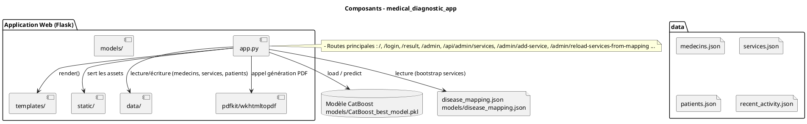
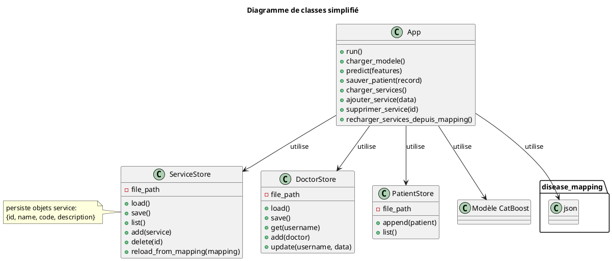
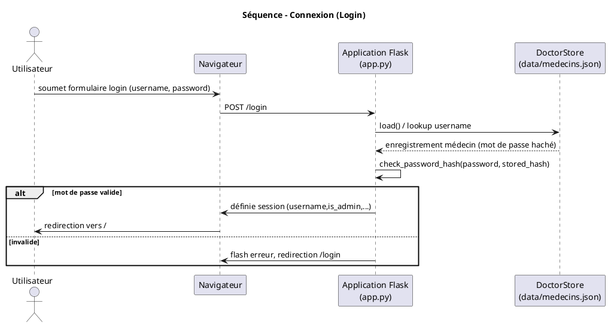
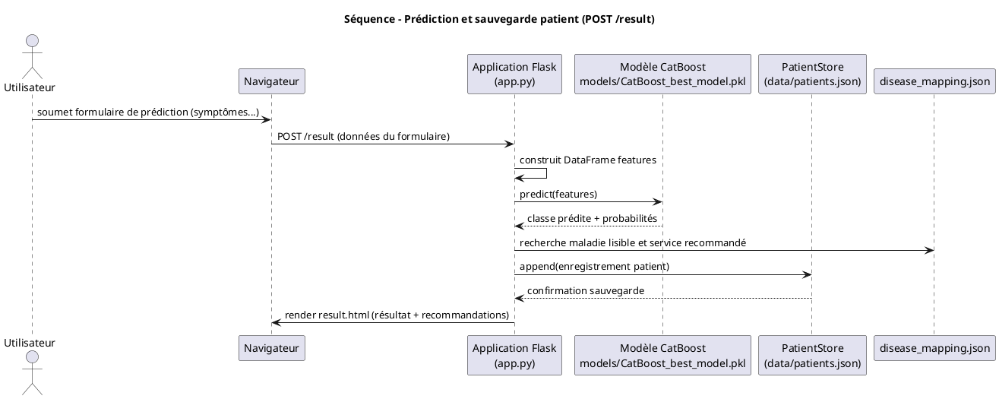
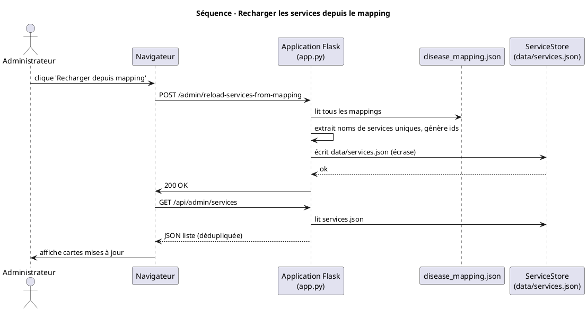
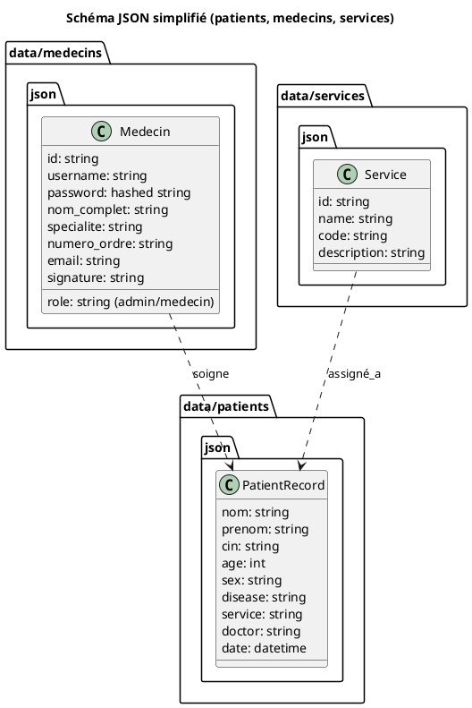
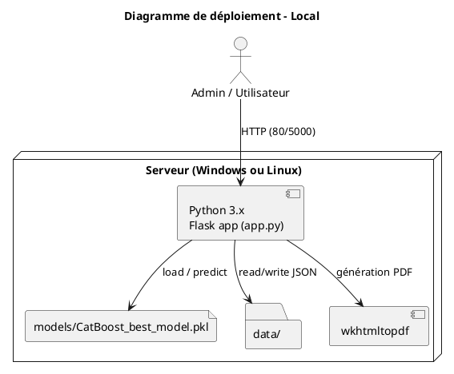

# Rapport technique — Application de Diagnostic Médical (CHU)

## Résumé exécutif

Ce document résume l'architecture, les fonctionnalités, les flux, la persistance et les recommandations de tests pour l'application de diagnostic médical développée en Python/Flask. Il sert de base pour le rapport de stage et contient les sections techniques, les scénarios de test et les recommandations opérationnelles.

## Architecture Générale


## Composants Principaux


## Flux Utilisateur (haute-niveau)

1. Authentification : `/login` — validation via `doctors` (in-memory initialisé depuis `data/medecins.json`).
2. Diagnostic : formulaire patient → POST `/result` → DataFrame Pandas réordonné selon `model.feature_names_` → `model.predict` + `predict_proba` → mapping via `disease_mapping.json` → affichage `result.html` et persistance dans `data/patients.json`.
3. PDF : génération via `pdfkit.from_string()` en s'appuyant sur `pdf_template.html`.
4. Administration : `/admin` (protégé) — liste médecins, ajouter médecin (id auto-généré), toggle activation, reset mot de passe, activité et liste patients.

## Pages & Endpoints Clés


## Données et Format


Remarque : la correspondance des colonnes du DataFrame avec `model.feature_names_` est critique — respecter les noms (espaces inclus).

## Sécurité & Bonnes Pratiques


Recommandations : ajouter CSRF (Flask-WTF), migrer vers une base de données (SQLite/Postgres), ajouter journalisation des actions critiques.

## Tests recommandés


## Limitations & Améliorations futures


## Annexes — exemples rapides

```
; .\venv\Scripts\Activate.ps1
pip install -r requirements.txt
python app.py
```

_Fichier généré automatiquement par l'assistant — modifiez-le si nécessaire pour votre rapport de stage._

This file summarizes all recent modifications made to the project to support the admin dashboard improvements, services management, patient persistence and UI refinements.

---

## 1. High-level summary

- Admin dashboard: new responsive Services management (cards), Add service, Delete service, and a "Reload from mapping" action that regenerates `data/services.json` from `models/disease_mapping.json`.
- Services are deduplicated both server-side and client-side to avoid duplicate cards.
- Service card UI density reduced: cards are smaller and the grid is responsive.
- Doctors add-form: server-side generation of `id`, `numero_ordre`, and `signature` (already applied earlier).
- Patient persistence: predictions are saved to `data/patients.json` so admins can review patients in the dashboard.
- Security/operational notes: password hashing used; persistent data stored in `data/*.json` (development), `WKHTMLTOPDF_CMD` environment support for PDF generation.

## 2. Files changed (concise)

- `app.py`
	- Added `/api/admin/services` (GET) — returns services, builds defaults from `models/disease_mapping.json` when missing, and deduplicates by `id` and case-insensitive `name` before returning.
	- Added `/admin/add-service` (POST) — create a service (accepts JSON or form data) and persists to `data/services.json`.
	- Added `/admin/delete-service` (POST) — delete a service by `id`.
	- Added `/admin/reload-services-from-mapping` (POST) — (admin only) regenerate `data/services.json` from `models/disease_mapping.json`.
	- Patient persistence improvements (predictions saved to `data/patients.json`) and other admin checks (already present or improved previously).

- `static/admin.js`
	- Added `loadServices()` and `renderServices()` to fetch and render services.
	- Client-side deduplication before rendering (normalize by `id` or `name`).
	- Removed inline card width so CSS controls card sizing.
	- AJAX handlers: add-service POST, delete-service POST, reload-from-mapping POST and UI updates.

- `static/admin_full.css`
	- Added `#services-grid` flex layout and reduced `.action-card` size for denser display (now 220×160 px, responsive).
	- Kept header/back-button and other admin styles.

- `templates/admin_dashboard.html` (edited earlier)
	- Includes Services section with `#services-grid`, add-service form, and reload button; Patients section and doctors list exist in the same dashboard template.

## 3. Behavior details

- On first call to `/api/admin/services` when `data/services.json` does not exist or is empty, the server builds a unique list from `models/disease_mapping.json` (one service entry per distinct service name), persists it to `data/services.json`, and returns it.
- Client-side `renderServices` deduplicates again and renders cards inside `#services-grid`.
- The "Recharger depuis mapping" button calls `/admin/reload-services-from-mapping` and replaces the current `data/services.json` with the regenerated list.

## 4. How to run and verify locally

1. Create and activate your virtualenv (PowerShell):
```powershell
python -m venv venv
; .\venv\Scripts\Activate.ps1
pip install -r requirements.txt
```
2. Ensure `wkhtmltopdf` is installed or set `WKHTMLTOPDF_CMD` if needed.
3. Start the app:
```powershell
python app.py
```
4. Use your browser to go to `http://127.0.0.1:5000`, log in as an admin user (exists in `data/medecins.json`).
5. Go to Admin → Services. Verify:
	 - Services appear as smaller cards that wrap responsively.
	 - There are no duplicate cards for the same service.
	 - Add a service via the form — it is persisted and shown.
	 - Delete a service — it is removed from `data/services.json` and the UI.
	 - Click "Recharger depuis mapping" — `data/services.json` is regenerated from `models/disease_mapping.json` and the grid reloads.

## 5. Notes, limitations, and recommendations

- Data persistence uses JSON files under `data/` (suitable for prototype/dev). For production, migrate to a real database (SQLite/Postgres) to handle concurrency and durability.
- CSRF protection is not currently implemented for POST forms and should be added (Flask-WTF or similar) for production.
- Current add-service endpoint allows duplicate names to be created; duplicates are filtered on response/display. If you prefer strict prevention, implement a server-side uniqueness check that returns 409 on duplicates or merges them upon save.
- Consider backing up `data/services.json` before overwriting when reloading from the mapping.

## 6. Next steps (I can implement any of these)

- Prevent duplicate service creation server-side (reject duplicates).
- Implement edit-service flow (UI modal + `/admin/edit-service` endpoint).
- Add CSRF protection and tighten admin auth checks.
- Migrate JSON persistence to SQLite and add simple tests.

---

If you want, I can now generate a finalized `README_RAPPORT.md` file in the repository (this file) including screenshots or a changelog by commit, or implement one of the next-step items above — tell me which you prefer.

## Annexe — Codes PlantUML (en français)

Vous trouverez ci-dessous les sources PlantUML de tous les diagrammes UML fournis. Copiez chaque bloc dans un fichier `.puml` (par ex. `uml/component_overview.puml`) puis rendez-les localement avec PlantUML ou via l'extension PlantUML pour VS Code.

---

### `component_overview.puml`


### `class_overview.puml`


### `sequence_login.puml`


### `sequence_prediction.puml`


### `sequence_reload_services.puml`


### `data_model_json.puml`


### `deployment_diagram.puml`


---

Fin des codes PlantUML.

Vous voulez que j'ajoute ces fichiers `.puml` sous un dossier `uml/` dans le dépôt ? Je peux les créer pour vous (puis vous les rendre localement).
